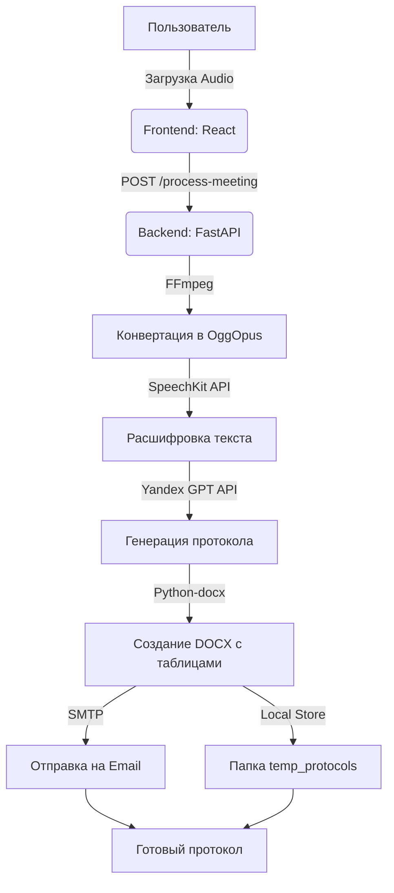

# Meeting Protocol Creator 📝🎤

Автоматизированная система создания профессиональных протоколов совещаний из аудиозаписей с использованием ИИ.

---

## 🛠 Технологический стек проекта

| Компонент | Технологии |
|-----------|------------|
| **Frontend** | React, Vite, CSS (Modern UI/UX), Axios |
| **Backend** | Python, FastAPI, Uvicorn |
| **AI / ML** | Yandex SpeechKit (STT), Yandex GPT (LLM) |
| **Инструменты** | FFmpeg (конвертация аудио), Python-docx (генерация Word) |
| **Email** | SMTP Integration |

---

## 📊 Архитектура и Процесс (Mermaid)

---

## ⭐ Сложность проекта
**Сложность: ⭐⭐⭐⭐ (4 звезды - Middle+/Senior)**

*Интеграция нескольких облачных API, сложная обработка аудио потоков через FFmpeg, и динамическая генерация документов со строгим корпоративным форматированием делают этот проект серьезным инженерным решением.*

---

## 🚀 Как запустить

### Бэкенд
1. Установите зависимости: `pip install -r requirements.txt`
2. Настройте `.env` (API ключи Yandex Cloud).
3. Запустите сервер: `python -m uvicorn main:app --port 8000`

### Фронтенд
1. Установите зависимости: `npm install`
2. Запустите в режиме разработки: `npm run dev -- --port 5177`

---

## ✨ Основные возможности
- **Мировые стандарты:** Протоколы оформляются по правилам международного делового оборота.
- **Умные таблицы:** Поручения автоматически извлекаются из текста и упаковываются в Word-таблицу.
- **Поддержка тяжелых файлов:** Автоматическая конвертация и сжатие аудио для стабильной работы API.
