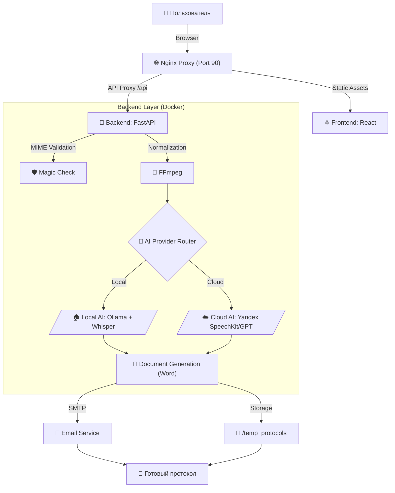

# PRO-Толк 📝🎥🎤

Автоматизированная система создания профессиональных протоколов совещаний из видео и аудиозаписей с использованием ИИ.

---

## 📊 Архитектура и Процесс



---

## 🛠 Технологический стек

| Компонент | Технологии |
|-----------|------------|
| **Frontend** | React, Vite, Framer Motion, Glassmorphism UI |
| **Backend** | Python, FastAPI, Pydantic |
| **Local ML** | Ollama (LLM), Faster-Whisper (STT - **CUDA**) |
| **Cloud ML** | Yandex SpeechKit, Yandex GPT (Latest) |
| **Core Tools** | FFmpeg, Magic-Python, Python-docx |
| **Tracing** | Langfuse (SDK v4) |

---

## ⭐ Сложность проекта
**Сложность: ⭐⭐⭐⭐ (4 звезды - Middle+/Senior)**

*Проект сочетает в себе сложный аудио-процессинг, гибридную архитектуру нейросетей и динамическую генерацию корпоративной отчетности. Это не просто оболочка над GPT, а полноценный конвейер обработки данных.*

---

## 🚀 Быстрый старт (Docker)

1.  **Настройка:** Отредактируйте `backend/.env`. 
    - Установите `AI_PROVIDER=local` для работы на своем ПК.
    - Установите `AI_PROVIDER=yandex` для использования облачных мощностей.
2.  **Запуск (GPU NVIDIA - Рекомендуется):**
    ```bash
    docker-compose up -d --build
    ```
    *(Убедитесь, что установлены NVIDIA Container Toolkit и актуальные драйверы)*.
3.  **Запуск (CPU):**
    Если у вас нет GPU, удалите секцию `deploy` с `reservations` из `docker-compose.yml` перед запуском.

---

## 💻 Системные требования (Local AI)
Для стабильной работы "Turbo" режима на локальной машине:
- **GPU**: NVIDIA RTX 3060 12GB или выше (рекомендуется для загрузки двух моделей одновременно).
- **RAM/WSL**: Минимум 8 ГБ выделенной памяти для WSL2.
- **Драйверы**: NVIDIA Driver 560+ и NVIDIA Container Toolkit.

---

## 🎙️ Профессиональная диаризация
В системе реализованы два режима разделения спикеров:
1.  **AI-Fallback:** Анализ текста и контекста для разделения реплик силами LLM.
2.  **Cloud Diarization:** Точное распознавание голосов через Yandex SpeechKit (требует настройки S3-бакета).

---

## ✨ Основные возможности
- **Мировые стандарты:** Протоколы оформляются по правилам международного делового оборота.
- **Умные таблицы:** Поручения автоматически упаковываются в Word/Markdown таблицы.
- **Интеграция с Email:** Автоматическая рассылка протоколов участникам.
- **Безопасность**: Полностью приватный режим при использовании локальных моделей.
