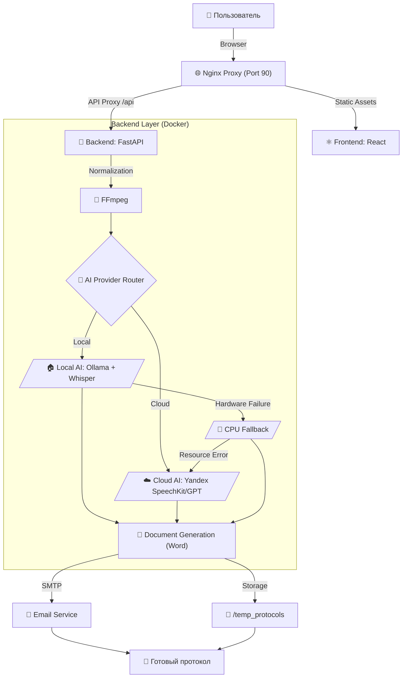

# Протоколист v5.2.0 🚀📝🎥🎤

Автоматизированная система создания профессиональных протоколов совещаний из текста, видео- и аудиозаписей с использованием ИИ. 
**Версия 5.2.0 (Stable Multi-tasking & VRAM Optimized)**

---

## 📊 Архитектура и Процесс

---

## ✨ Ключевые особенности v5.2.0 (Security & Enterprise Readiness)
- **🛡️ Харденинг безопасности:** Комплексная защита от атак типа Disk Fill, Path Traversal и Prompt Injection.
- **🧱 Ограничение ресурсов:** Внедрена система квот на объем хранилища и размер очереди задач (DoS Protection).
- **🔄 Самовосстановление:** Автоматическая очистка и сброс "зомби-задач" при перезагрузке сервера.
- **🗄️ SQLite Reliability:** Полный переход на WAL-режим и атомарные транзакции для гарантированной целостности данных.
- **🌐 Безопасный API:** Усиленная валидация входящих данных и строгие политики CORS.
- **📝 Прямой импорт текста:** (v5.1+) Поддержка загрузки DOCX, PDF и TXT для мгновенного анализа.
- **✨ Обновленный UI/UX:** (v5.0+) Индикаторы контуров безопасности и обновленный дизайн шапки.

---

## 🛠 Технологический стек

| Компонент | Технологии |
|-----------|------------|
| **Frontend** | React, Vite, Framer Motion, Glassmorphism UI |
| **Backend** | Python, FastAPI, Pydantic |
| **Local AI** | Ollama (Qwen 3.5), Faster-Whisper Turbo (CUDA) |
| **Cloud AI** | Yandex SpeechKit v2, Yandex GPT (Latest) |
| **Observability** | Langfuse v4 (SDK + UI) |

---

## 💻 Системные требования
- **GPU**: NVIDIA RTX 3060 12GB+ (для Turbo-режима).
- **RAM**: Минимум 16 ГБ RAM.
- **OS**: Windows (с NVIDIA Container Toolkit) или Linux.

---

## ✨ Основные возможности
- **Мировые стандарты:** Протоколы по ГОСТ и правилам международного делового оборота.
- **Умные таблицы:** Автоматическая упаковка поручений в DOCX-таблицы.
- **Интеграция с Email:** Рассылка результатов участникам "в один клик".
- **Безопасность**: Полная приватность данных в режиме Local.
