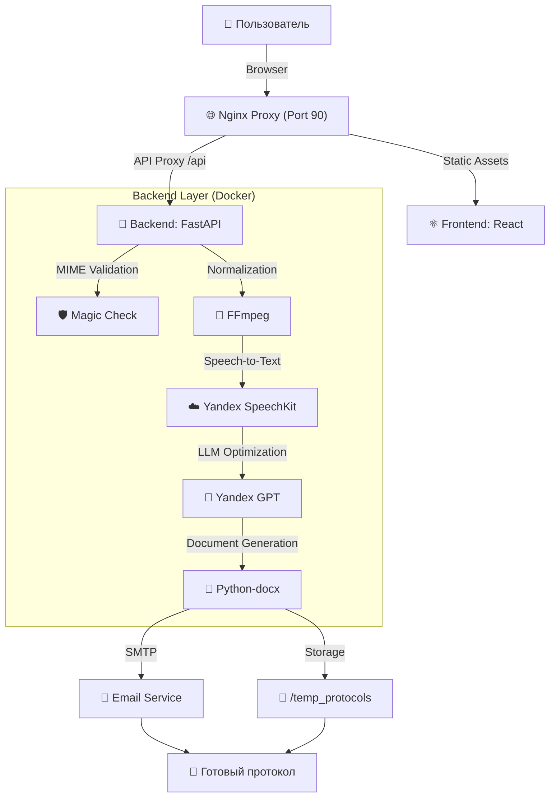

# Meeting Protocol Creator 📝🎤

Автоматизированная система создания профессиональных протоколов совещаний из аудиозаписей с использованием ИИ.

---

## 🛠 Технологический стек проекта

| Компонент | Технологии |
|-----------|------------|
| **Frontend** | React, Vite, CSS (Modern UI/UX), Axios |
| **Backend** | Python, FastAPI, Uvicorn |
| **AI / ML** | Yandex SpeechKit (STT), Yandex GPT (LLM) |
| **Инструменты** | FFmpeg (конвертация аудио), Python-docx (генерация Word) |
| **Email** | SMTP Integration |

---

## 📊 Архитектура и Процесс (Mermaid)



---

## ⭐ Сложность проекта
**Сложность: ⭐⭐⭐⭐ (4 звезды - Middle+/Senior)**

*Интеграция нескольких облачных API, сложная обработка аудио потоков через FFmpeg, и динамическая генерация документов со строгим корпоративным форматированием делают этот проект серьезным инженерным решением.*

---

## 🚀 Как запустить (Docker - Рекомендуется)

Самый простой и надежный способ запустить проект — использовать Docker Compose.

1.  **Настройка окружения:** Убедитесь, что в папке `backend/.env` прописаны ваши ключи (Yandex Cloud API Key, Folder ID и др.).
2.  **Запуск:** В корне проекта выполните команду:
    ```bash
    docker-compose up -d --build
    ```
3.  **Доступ:**
    *   **Frontend:** [http://localhost:90](http://localhost:90) 🌐
    *   **Backend API:** [http://localhost:8000/docs](http://localhost:8000/docs) (Swagger UI) 📑
    *   **Health Check:** [http://localhost:8000/health](http://localhost:8000/health) 🩺

---

## 🎙️ Профессиональная диаризация (разделение спикеров)

В проекте реализована **гибридная система** определения участников совещания:

1.  **AI-Fallback (по умолчанию):** Если S3 не настроен, YandexGPT анализирует текст и «догадывается» о смене спикеров по контексту. 
2.  **Native Diarization (рекомендуется):** Распознавание голоса на уровне облака. Для этого нужно:
    *   Создать бакет в [Yandex Object Storage](https://cloud.yandex.ru/docs/storage/).
    *   Создать [Сервисный аккаунт](https://cloud.yandex.ru/docs/iam/operations/sa/create) с ролью `storage.editor`.
    *   Получить статические ключи доступа (Access Key и Secret Key).
    *   Прописать их в `backend/.env`:
        ```bash
        YANDEX_ACCESS_KEY=your_access_key
        YANDEX_SECRET_KEY=your_secret_key
        YANDEX_S3_BUCKET=your_bucket_name
        ```

### Ручной запуск (Dev)

Если вы хотите запустить проект без Docker:
1.  **Бэкенд:** `cd backend`, `pip install -r requirements.txt`, `python -m uvicorn main:app --port 8000`
2.  **Фронтенд:** `cd frontend`, `npm install`, `npm run dev -- --port 90` (предварительно поменяв API URL в `api.js`)

---

## ✨ Основные возможности
- **Мировые стандарты:** Протоколы оформляются по правилам международного делового оборота.
- **Умные таблицы:** Поручения автоматически извлекаются из текста и упаковываются в Word-таблицу.
- **AI-Аудитор (Self-Critique):** Встроенная система проверки точности — ИИ-ассистент сверяет протокол с расшифровкой и ищет ошибки.
- **Гибридная диаризация:** Автоматическое разделение реплик спикеров даже без сложной настройки облака.
- **Поддержка тяжелых файлов:** Автоматическая конвертация и сжатие аудио для стабильной работы API.
