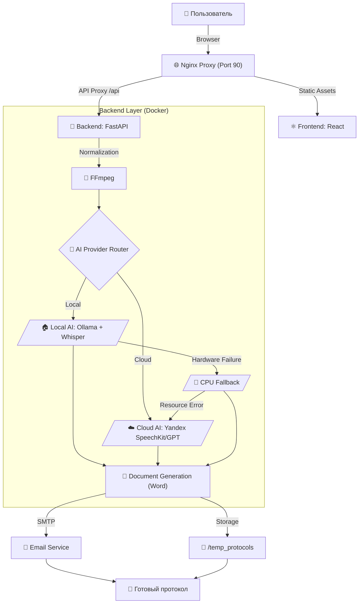

# Протоколист v5.2.0 🚀📝🎥🎤

Автоматизированная система создания профессиональных протоколов совещаний из текста, видео- и аудиозаписей с использованием ИИ. 
**Версия 5.2.0 (Stable Multi-tasking & VRAM Optimized)**

---

## 📊 Архитектура и Процесс

---

## ✨ Ключевые особенности v5.2.0
- **🛡️ Стабильность очереди:** Полностью решена проблема "падения" бэкенда при обработке 2-3 файлов подряд.
- **🧱 Глобальный кэш (Whisper):** Модели ИИ теперь загружаются один раз и переиспользуются, что исключает утечки видеопамяти.
- **🔄 Самовосстановление:** Система автоматически очищает очередь от зависших задач при перезагрузке.
- **📝 Прямой импорт текста:** Поддержка загрузки DOCX, PDF и TXT. Система мгновенно извлекает текст для анализа, минуя транскрибацию.
- **✨ Обновленный UI/UX:** Полностью переработанная шапка с индикаторами режима (Система, Модель, Контур). Новые иконки безопасности (Lock/LockOpen).
 - **🇷🇺 Полная локализация:** Все сообщения об ошибках и статусы бэкенда теперь на русском языке.
 - **🚀 Whisper Large-v3-Turbo:** Ускорение транскрипции до 3 раз при сохранении высокого качества текста.
 - **🤖 Qwen 3.5 (9B):** Новейший интеллект для глубокого анализа контекста и безупречной структуры протокола.
 - **🛡️ VRAM Hot-Swap:** Динамическое управление видеопамятью через `keep_alive: 0`. Полная стабильность на картах RTX 3060 12GB.
 - **📧 Flexible Emailing:** Новый переключатель в интерфейсе для опциональной отправки протокола на почту + умная обработка ошибок SMTP.
 - **🛡️ Resilience (Отказоустойчивость):** Атомарное сохранение состояния через SQLite — надежное возобновление после сбоев.
 - **🚀 Ultra-fast Sync:** Частота обновления статусов в UI увеличена в 2.5 раза для лучшего пользовательского опыта.

---

## 🛠 Технологический стек

| Компонент | Технологии |
|-----------|------------|
| **Frontend** | React, Vite, Framer Motion, Glassmorphism UI |
| **Backend** | Python, FastAPI, Pydantic |
| **Local AI** | Ollama (Qwen 3.5), Faster-Whisper Turbo (CUDA) |
| **Cloud AI** | Yandex SpeechKit v2, Yandex GPT (Latest) |
| **Observability** | Langfuse v4 (SDK + UI) |

---

## 💻 Системные требования
- **GPU**: NVIDIA RTX 3060 12GB+ (для Turbo-режима).
- **RAM**: Минимум 16 ГБ RAM.
- **OS**: Windows (с NVIDIA Container Toolkit) или Linux.

---

## ✨ Основные возможности
- **Мировые стандарты:** Протоколы по ГОСТ и правилам международного делового оборота.
- **Умные таблицы:** Автоматическая упаковка поручений в DOCX-таблицы.
- **Интеграция с Email:** Рассылка результатов участникам "в один клик".
- **Безопасность**: Полная приватность данных в режиме Local.
