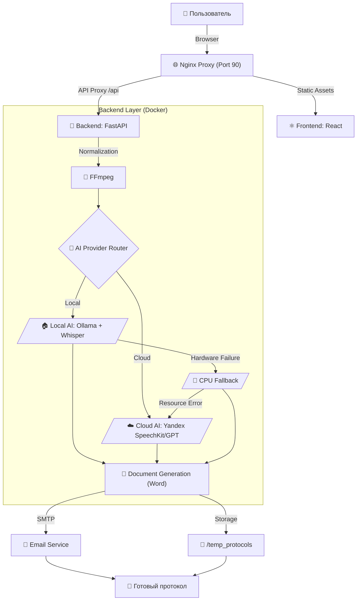

# Протоколист 📝🎥🎤

Автоматизированная система создания профессиональных протоколов совещаний из видео и аудиозаписей с использованием ИИ. 
**Версия 5.0.0 (All-In-One GPU & Stability Update)**

---

## 📊 Архитектура и Процесс



---

## ✨ Ключевые особенности v5.0.0
- **🚀 All-In-One GPU Architecture:** Полная акселерация всего пайплайна (**Whisper + Diarization + LLM**) на GPU. Модели сосуществуют в VRAM, обеспечивая мгновенный переход между этапами без задержек на загрузку.
- **🎙️ Speaker Diarization 3.1 (GPU):** Интеграция новейшей модели Pyannote 3.1 с поддержкой CUDA. Скорость анализа спикеров выросла в 7-10 раз по сравнению с CPU-версией.
- **🛡️ Rock-Solid Stability:** Новая стратегия управления памятью исключила критические ошибки DLL и вылеты процессов на Windows/WSL2 при переключении между стадиями транскрибации и генерации.
- **🏎️ Ultra-Performance:** Общая скорость обработки встреч выросла в **2.3 раза**. 10 минут записи теперь превращаются в качественный протокол менее чем за 6 минут.
- **🧠 AI-Аудитор 2.0:** Встроенный контроль качества с автоматическим выставлением оценок (Completeness, Accuracy) и выносом отчета аудитора в финал протокола.

---

## 🛠 Технологический стек

| Компонент | Технологии |
|-----------|------------|
| **Frontend** | React, Vite, Framer Motion, Glassmorphism UI |
| **Backend** | Python, FastAPI, Pydantic |
| **Local AI** | Ollama (Qwen 3.5 4B/9B), Faster-Whisper (CUDA), Pyannote 3.1 (CUDA) |
| **Cloud AI** | Yandex SpeechKit v2, Yandex GPT (Latest) |
| **Observability** | Langfuse v4 (SDK + UI) |
| **Tracing** | OpenTelemetry compatible status tracking |

---

## ⭐ Сложность проекта
**Сложность: ⭐⭐⭐⭐⭐ (5 звезд - Senior / Enterprise)**

*Проект представляет собой отказоустойчивый конвейер данных, способный работать в изолированных контурах (Local Only) или гибридных облаках с автоматическим управлением ресурсами.*

---

## 🚀 Быстрый старт (Docker)

1.  **Настройка:** Отредактируйте `backend/.env`. 
    - Установите `AI_PROVIDER=local` для работы на своем ПК.
    - Установите `AI_PROVIDER=yandex` для использования облачных мощностей.
2.  **Запуск (GPU NVIDIA - Рекомендуется):**
    ```bash
    docker-compose up -d --build
    ```
3.  **Запуск (CPU Fallback):**
    Система автоматически переключится на CPU, если GPU не будет обнаружен, но вы можете принудительно отключить reservations в `docker-compose.yml`.

---

## 💻 Системные требования
- **GPU**: NVIDIA RTX 3060 12GB (Золотой стандарт для All-In-One GPU).
- **RAM**: 32 ГБ RAM (Рекомендуется для стабильной работы с Whisper Medium и 9B моделями).
- **OS**: Windows 10/11 (WSL2 + NVIDIA Container Toolkit).

---

## ✨ Основные возможности
- **Мировые стандарты:** Протоколы по ГОСТ и правилам международного делового оборота.
- **Умные таблицы:** Автоматическая упаковка поручений в DOCX-таблицы.
- **Интеграция с Email:** Рассылка результатов участникам "в один клик".
- **Безопасность**: Полная приватность данных в режиме Local.
