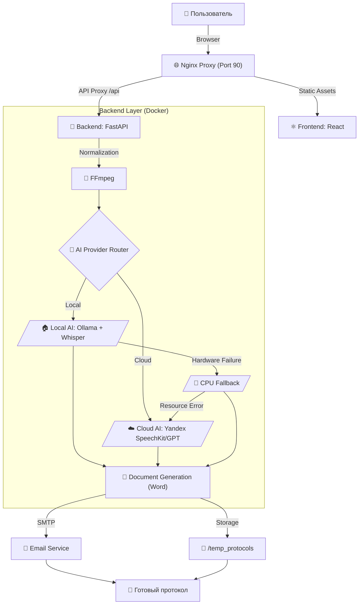

<<<<<<< HEAD
# Протоколист v5.0.0 🚀📝🎥🎤

Автоматизированная система создания профессиональных протоколов совещаний из видео и аудиозаписей с использованием ИИ. 
**Версия 5.0.0 (High-Speed Turbo & VRAM Optimization)**
=======
# Протоколист v4.4.0 🚀📝🎥🎤

Автоматизированная система создания профессиональных протоколов совещаний из видео и аудиозаписей с использованием ИИ. 
**Версия 4.4.0 (Diarization & Pipeline Stability)**
>>>>>>> f89b4176a9ea12e43e71c53c6ff04bc3f5d90149

---

## 📊 Архитектура и Процесс



---

<<<<<<< HEAD
## ✨ Ключевые особенности v5.0.0
- **🚀 Whisper Large-v3-Turbo:** Ускорение транскрипции до 3 раз по сравнению со стандартными моделями при сопоставимой точности.
- **🛡️ VRAM Hot-Swap:** Динамическое управление видеопамятью через `keep_alive: 0`. Полная поддержка карт RTX 3060 12GB даже для длинных записей (1ч+).
- **🎙️ Hybrid Diarization:** Двухэтапное распознавание спикеров (аудио-анализ + семантическая привязка имен в LLM).
- **🛡️ Resilience (Отказоустойчивость):** Внедрена система **Atomic Persistence** на базе SQLite для надежного возобновления работы.
- **🧠 Langfuse Observability:** Глубокий мониторинг качества и стоимости каждой встречи через Langfuse SDK.
- **🚀 Multi-worker Backend:** Поддержка нескольких воркеров обеспечивает мгновенную реакцию интерфейса.
- **🔒 Hardware Coordination:** Защита от конфликтов ресурсов через `gpu.lock`.
=======
## ✨ Ключевые особенности v4.4.0
- **🎙️ Hybrid Diarization:** Двухэтапное распознавание спикеров. Распознавание голосов дополнено семантическим анализом с помощью Ollama для привязки к реальным именам (с исправлениями Pipeline).
- **🛡️ Resilience (Отказоустойчивость):** Внедрена система **Atomic Persistence** на базе SQLite. Надежное возобновление работы после сбоев без гонок данных.
- **🧠 Langfuse Session Tracking:** Персистентное отслеживание сессий (`session_id`) для гранулярного мониторинга промптов и генерации каждой отдельной встречи.
- **🚀 Multi-worker Backend:** Поддержка нескольких воркеров обеспечивает 100% доступность интерфейса даже при высокой нагрузке на GPU.
- **🛡️ AI-Аудитор 2.0:** Автоматический контроль качества с выносом отчета аудитора в финал протокола (технический JSON скрыт от конечного пользователя).
- **🔒 Cross-process Locking:** Координация аппаратных ресурсов через `gpu.lock` для предотвращения ошибок памяти (OOM).
>>>>>>> f89b4176a9ea12e43e71c53c6ff04bc3f5d90149

---

## 🛠 Технологический стек

| Компонент | Технологии |
|-----------|------------|
| **Frontend** | React, Vite, Framer Motion, Glassmorphism UI |
| **Backend** | Python, FastAPI, Pydantic |
| **Local AI** | Ollama (Qwen 2.5 7B), Faster-Whisper (CUDA Optimized) |
| **Cloud AI** | Yandex SpeechKit v2, Yandex GPT (Latest) |
| **Observability** | Langfuse v4 (SDK + UI) |
| **Tracing** | OpenTelemetry compatible status tracking |

---

## ⭐ Сложность проекта
**Сложность: ⭐⭐⭐⭐⭐ (5 звезд - Senior / Enterprise)**

*Проект представляет собой отказоустойчивый конвейер данных, способный работать в изолированных контурах (Local Only) или гибридных облаках с автоматическим управлением ресурсами.*

---

## 🚀 Быстрый старт (Docker)

1.  **Настройка:** Отредактируйте `backend/.env`. 
    - Установите `AI_PROVIDER=local` для работы на своем ПК.
    - Установите `AI_PROVIDER=yandex` для использования облачных мощностей.
2.  **Запуск (GPU NVIDIA - Рекомендуется):**
    ```bash
    docker-compose up -d --build
    ```
3.  **Запуск (CPU Fallback):**
    Система автоматически переключится на CPU, если GPU не будет обнаружен, но вы можете принудительно отключить reservations в `docker-compose.yml`.

---

## 💻 Системные требования
- **GPU**: NVIDIA RTX 3060 12GB+ (для Turbo-режима).
- **RAM**: Минимум 16 ГБ RAM (8 ГБ для WSL2).
- **OS**: Windows (с NVIDIA Container Toolkit) или Linux.

---

## ✨ Основные возможности
- **Мировые стандарты:** Протоколы по ГОСТ и правилам международного делового оборота.
- **Умные таблицы:** Автоматическая упаковка поручений в DOCX-таблицы.
- **Интеграция с Email:** Рассылка результатов участникам "в один клик".
- **Безопасность**: Полная приватность данных в режиме Local.
