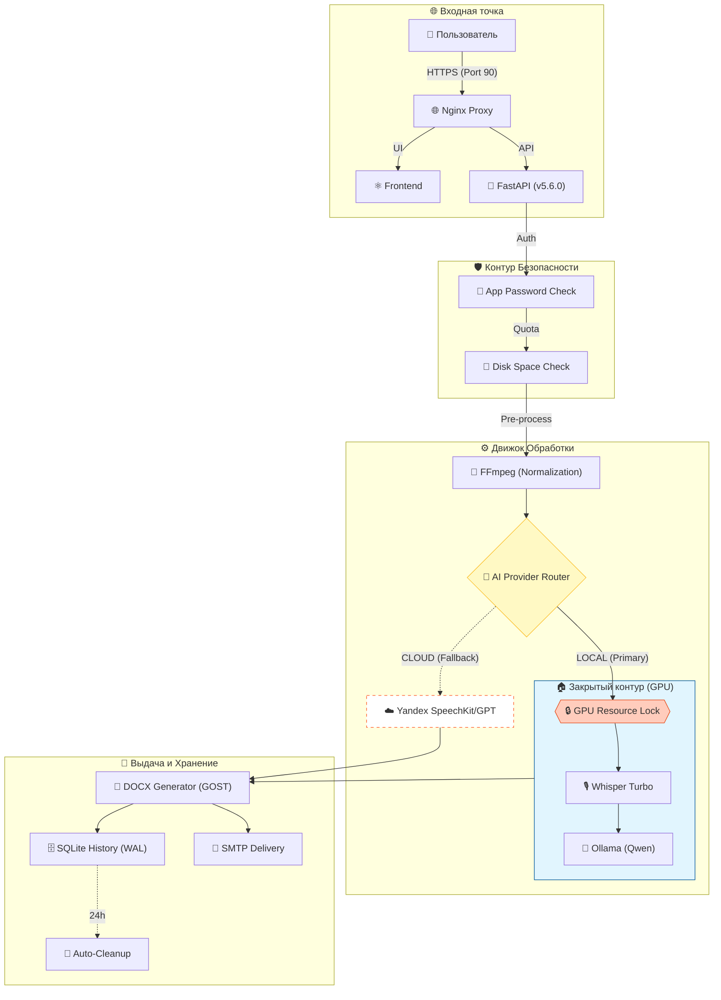

# Протоколист v5.7.2 🚀📝🛡️

Автоматизированная система создания профессиональных протоколов совещаний из текста, видео- и аудиозаписей с использованием ИИ. 
**Версия 5.7.2 (Dynamic Versioning & Offline Releases)**

---

## 📊 Архитектура и Процесс

---

## ✨ Ключевые особенности v5.6.0 (Portability & Hybrid Power)
+- **🚀 Портативность:** Полноценная поддержка переноса системы на другие машины через Docker-архивы (`save/load`).
+- **💻 Ноутбук-режим:** Возможность работы на устройствах без GPU NVIDIA через `docker-compose.cpu.yml`.
+- **📦 Автономность:** Готовые скрипты для упаковки (`PREPARE_FOR_CLIENT.bat`) и быстрого старта на новом месте.
 - **🔊 Extreme Sensitivity:** Распознавание даже самого тихого шепота благодаря двойной нормализации и фильтрам частот.
- **🧹 Чистые протоколы:** Удаление технического мусора (процентов уверенности) из итоговых документов.
- **🧠 Контекстное управление:** Поля ввода участников и тем встречи для повышения точности транскрибации.
- **✨ Transcript Refinement:** Интеллектуальное исправление опечаток и ошибок распознавания на основе контекста.
- **📈 Мониторинг ресурсов:** Визуальный индикатор свободного места на диске и размера очереди в футере UI.
- **🔐 Простой пароль:** Защита доступа к системе через пароль приложения.
- **📜 Архив протоколов:** Доступ к истории всех созданных документов через общий интерфейс.
- **🛡️ Харденинг безопасности:** Комплексная защита от атак типа Disk Fill, Path Traversal и Prompt Injection.
- **🧱 Ограничение ресурсов:** Внедрена система квот на объем хранилища и размер очереди задач (DoS Protection).
- **🔄 Самовосстановление:** Автоматическая очистка и сброс "зомби-задач" при перезагрузке сервера.
- **🗄️ SQLite Reliability:** Полный переход на WAL-режим и атомарные транзакции для гарантированной целостности данных.
- **🌐 Безопасный API:** Усиленная валидация входящих данных и строгие политики CORS.
- **📝 Прямой импорт текста:** (v5.1+) Поддержка загрузки DOCX, PDF и TXT для мгновенного анализа.
- **✨ Обновленный UI/UX:** (v5.0+) Индикаторы контуров безопасности и обновленный дизайн шапки.

---

## 🛠 Технологический стек

| Компонент | Технологии |
|-----------|------------|
| **Frontend** | React, Vite, Framer Motion, Glassmorphism UI |
| **Backend** | Python, FastAPI, Pydantic |
| **Local AI** | Ollama (Qwen 3.5), Faster-Whisper Turbo (CUDA) |
| **Cloud AI** | Yandex SpeechKit v2, Yandex GPT (Latest) |
| **Observability** | Langfuse v4 (SDK + UI) |

---

## 💻 Системные требования
- **GPU**: NVIDIA RTX 3060 12GB+ (для Turbo-режима).
- **RAM**: Минимум 16 ГБ RAM.
- **OS**: Windows (с NVIDIA Container Toolkit) или Linux.

---

## ✨ Основные возможности
- **Мировые стандарты:** Протоколы по ГОСТ и правилам международного делового оборота.
- **Умные таблицы:** Автоматическая упаковка поручений в DOCX-таблицы.
- **Интеграция с Email:** Рассылка результатов участникам "в один клик".
- **Безопасность**: Полная приватность данных в режиме Local.
